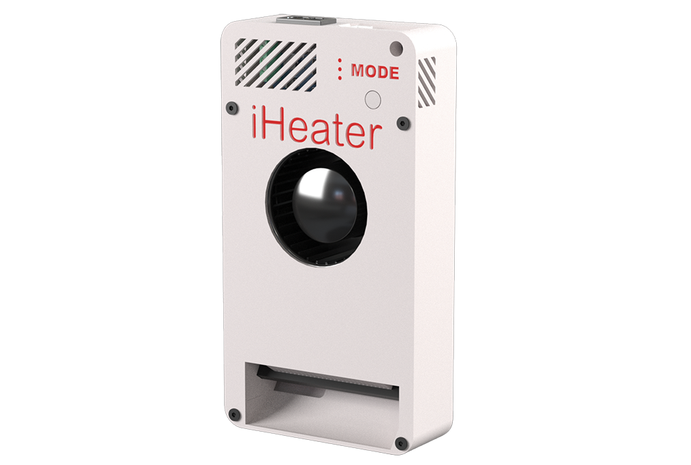

[](https://github.com/pavluchenkor/iHeater-Standalone-Firmware/releases)


# Standalone iHeater Firmware

iHeater is a compact and affordable solution for 3D printers without an active heated chamber or with limited connection options to the mainboard. It's especially useful for printers with proprietary boards lacking free ports for fans, heaters, or thermistors. iHeater solves this with a simple and universal approach.

It can operate standalone with its own firmware or be integrated with Klipper over USB.



---

## About the Firmware

**iHeater** is firmware for a standalone device that manages the temperature of a 3D printer's heated chamber.

---

## Purpose

The device ensures heating and stable temperature maintenance inside the printer's chamber, which is critical for printing ABS, ASA, and other shrinkage-sensitive and adhesion-sensitive filaments.

---

## How to Configure the Firmware

### File `config.h`

This file contains all configurable parameters:

| Parameter                                 | Description                                                                                   |
| ----------------------------------------- | --------------------------------------------------------------------------------------------- |
| `SELECTED_THERMISTOR_TYPE`                | Select thermistor type (0–5, see below)                                                       |
| `MODE0`–`MODE7`                           | Setpoint temperatures for each mode. Can be any float value, e.g. `MODE4 67.5`                |
| `MAX_TEMP`, `MIN_TEMP`                    | Allowed temperature range for the heater                                                      |
| `MAX_AIR_TEMP`, `MIN_AIR_TEMP`            | Allowed temperature range for air                                                             |
| `HEATER_MIN_PWM`                          | Minimum PWM required to start heater response monitoring                                      |
| `HEATER_RESPONSE_TIMEOUT_MS`              | Timeout for detecting heater response (default 5 seconds)                                     |
| `AIR_TARGET_TIMEOUT_MS`                   | Maximum time allowed to reach air target temperature (default 10 minutes)                    |
| `TIMER_CLOCK`, `PWM_FREQUENCY`, `PWM_STEPS` | PWM configuration (frequency and resolution)                                                |

### Thermistors

Selected using `SELECTED_THERMISTOR_TYPE`:

| ID | Type                          | Notes                              |
|----|-------------------------------|-------------------------------------|
| 0  | ATC Semitec 104GT-2           | Standard used by E3D                |
| 1  | ATC Semitec 104NT-4-R025H42G  | 104GT alternative                   |
| 2  | EPCOS 100K B57560G104F        | Widely used                         |
| 3  | Generic 3950                  | **Default**, common Chinese type    |
| 4  | SliceEngineering 450          | High-temp support                   |
| 5  | TDK NTCG104LH104JT1           | Medical-grade accuracy              |

### Temperature Modes and LEDs

Each mode sets a target temperature and is displayed via binary LEDs:

| Mode   | Temperature | LED3 | LED2 | LED1 |
|--------|-------------|------|------|------|
| MODE0  | 0.0°C       | 0    | 0    | 0    |
| MODE1  | 55.0°C      | 0    | 0    | 1    |
| MODE2  | 60.0°C      | 0    | 1    | 0    |
| MODE3  | 65.0°C      | 0    | 1    | 1    |
| MODE4  | 70.0°C      | 1    | 0    | 0    |
| MODE5  | 75.0°C      | 1    | 0    | 1    |
| MODE6  | 80.0°C      | 1    | 1    | 0    |
| MODE7  | 85.0°C      | 1    | 1    | 1    |

---

## How to Flash the Firmware

### Using Precompiled Binary

If you haven't made code changes, a ready-to-use `.bin` file is located in the `Firmware` folder, for example:

```
Firmware/iHeater_v1.2.3.bin
```

This firmware is pre-configured with the temperature modes from MODE0 to MODE7 (as described above) and designed to work with a Generic 3950 thermistor (type 3 in `config.h`).

### Using DFU (USB)

1. Set the BOOT0 jumper to enable DFU mode
2. Connect USB; the device should appear as a DFU device
3. Flash the firmware:
   ```bash
   dfu-util -a 0 -s 0x08000000 -D Firmware/iHeater_vX.Y.Z.bin
   ```
4. Remove the jumper and power cycle the device

### Using STM32CubeProgrammer

1. Connect via ST-Link or USB-UART depending on your board
2. Open STM32CubeProgrammer
3. Connect to the device
4. Browse and select your `.bin` file (e.g. `Firmware/iHeater_v1.2.3.bin`)
5. Set download address to: `0x08000000`
6. Click "Start Programming"

---

## How to Use

- **Short press** MODE button — cycle through temperature modes (0–7)
- **Long press (2+ seconds)** — reset to MODE0 (OFF)
- **LEDs** indicate current mode in binary (see table above)
- **Blinking LEDs** — heating in progress
- **Solid LEDs** — target temperature reached

---

## Error Handling

The device auto-resets and shows an error code using LED indicators.

| Code  | Description                               | LED1 | LED2 | LED3  |
|-------|-------------------------------------------|------|------|-------|
| 0x01  | Air failed to reach target in time        | ON   | OFF  | OFF   |
| 0x02  | Heater not responding                     | OFF  | ON   | OFF   |
| 0x03  | Manual shutdown (unused)                  | ON   | ON   | OFF   |
| 0x04  | Air thermistor disconnected                | OFF  | OFF  | ON    |
| 0x05  | Heater thermistor disconnected             | ON   | OFF  | ON    |
| 0x06  | Heater overtemperature                     | OFF  | ON   | ON    |
| 0x07  | Air overtemperature                        | ON   | ON   | ON    |
| 0xFF  | Unknown error                              | ALL  | SOLID| ON    |

### Resetting an Error

Hold the MODE button during startup until the LEDs change. The stored error will be cleared from flash memory, and the device will resume normal operation.

---

This software is licensed under the GNU General Public License v3.0 for non-commercial use only.