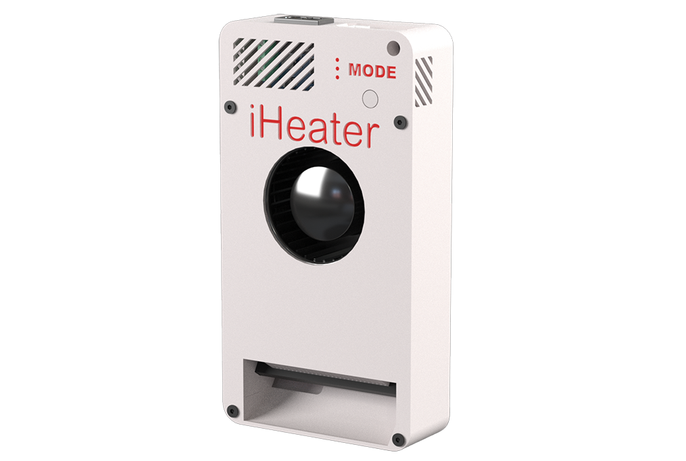

[](https://github.com/pavluchenkor/iHeater-Standalone-Firmware/releases)
[](https://docs.idryer.org/iHeater/README_ru/)
[](https://t.me/iDryer)


# Standalone iHeater Firmware

iHeater - это компактное и доступное решение для 3D-принтеров без активной термокамеры или с ограниченными возможностями подключения к материнской плате. Он особенно полезен для моделей с проприетарными платами, где нет свободных разъёмов для вентилятора, нагревателя или термистора. iHeater решает эту задачу простым и универсальным способом.


Может работать самостоятельно с собственной прошивкой как отдельное устройство или под управлением Klipper с подключением к принтеру по USB



---

## О прошивке

**iHeater** - это прошивка для автономного устройства управления температурой камеры 3D-принтера. 

---

## Назначение

Устройство обеспечивает нагрев и поддержание стабильнуой температуры внутри камеры 3D-принтера, что критично для печати ABS, ASA и других температурозависимых пластиков с высокой усадкой и низкой адгезией слоев.

---

## Как настроить прошивку

### Файл `config.h`

В этом файле задаются параметры работы устройства:
Файл находится в папке Core/Inc/config.h

| Параметр                                    | Назначение                                                                                          |
| ------------------------------------------- | --------------------------------------------------------------------------------------------------- |
| `SELECTED_THERMISTOR_TYPE`                  | Выбор типа термистора (0-5, см. ниже)                                                               |
| `MODE_TEMP_0`-`MODE_TEMP_7`                             | Температуры для каждого режима. Можно задать любое значение, включая дробные, например `MODE_TEMP_4 67.5` |
| `MAX_TEMP`, `MIN_TEMP`                      | Допустимый диапазон температур нагревателя                                                          |
| `MAX_AIR_TEMP`, `MIN_AIR_TEMP`              | Диапазон температур воздуха                                                                         |
| `HEATER_MIN_PWM`                            | Минимальный PWM, при котором система начнёт проверку ответа нагревателя                             |
| `HEATER_RESPONSE_TIMEOUT_MS`                | Время ожидания роста температуры нагревателя (по умолчанию 5 сек)                                   |
| `AIR_TARGET_TIMEOUT_MS`                     | Максимальное время достижения целевой температуры воздуха (по умолчанию 10 мин)                     |
| `TIMER_CLOCK`, `PWM_FREQUENCY`, `PWM_STEPS` | Настройка частоты и качества ШИМ                                                                    |

### Термисторы

Выбираются в `SELECTED_THERMISTOR_TYPE`. Поддерживаются:

| ID | Тип                          | Комментарий                           |
| -- | ---------------------------- | ------------------------------------- |
| 0  | ATC Semitec 104GT-2          | Стандарт от E3D                       |
| 1  | ATC Semitec 104NT-4-R025H42G | Аналог 104GT                          |
| 2  | EPCOS 100K B57560G104F       | Популярен                             |
| 3  | Generic 3950                 | **По умолчанию**, широко используемый |
| 4  | SliceEngineering 450         | Поддержка высоких температур          |
| 5  | TDK NTCG104LH104JT1          | Медицинский, точный                   |

### Режимы температуры и светодиоды

Режим задаётся значением температуры и отображается в двоичном виде тремя светодиодами:

| Режим | Температура | LED3 | LED2 | LED1 |
| ----- | ----------- | ---- | ---- | ---- |
| MODE_TEMP_0 | 0.0°C       | 0    | 0    | 0    |
| MODE_TEMP_1 | 55.0°C      | 0    | 0    | 1    |
| MODE_TEMP_2 | 60.0°C      | 0    | 1    | 0    |
| MODE_TEMP_3 | 65.0°C      | 0    | 1    | 1    |
| MODE_TEMP_4 | 70.0°C      | 1    | 0    | 0    |
| MODE_TEMP_5 | 75.0°C      | 1    | 0    | 1    |
| MODE_TEMP_6 | 80.0°C      | 1    | 1    | 0    |
| MODE_TEMP_7 | 85.0°C      | 1    | 1    | 1    |

---

## Как прошить

### Скачать

[Скачайте прошивку со страницы релизов](https://github.com/pavluchenkor/iHeater-Standalone-Firmware/releases)


### Использование готовой прошивки

Прошивка уже сконфигурирована с температурными режимами от MODE_TEMP_0 до MODE_TEMP_7, описанными выше, и предназначена для работы с термистором типа Generic 3950 (тип 3 по списку в `config.h`).

### Через DFU (USB)

1. Установите джампер BOOT0 (в DFU режим)
2. Подключите USB, устройство определится как DFU
3. Загрузите прошивку:
   ```bash
   dfu-util -a 0 -s 0x08000000 -D Firmware/iHeater_vX.Y.Z.bin
   ```
4. Уберите джампер и перезапустите питание

### Через STM32CubeProgrammer

1. Подключите ST-Link или USB (в зависимости от вашей платы)
2. Откройте STM32CubeProgrammer
3. Подключитесь к устройству
4. Укажите путь к `.bin`-файлу прошивки (например: `Firmware/iHeater_v1.2.3.bin`)
5. Установите адрес загрузки: `0x08000000`
6. Нажмите "Start Programming"

---

## Как пользоваться

- **Короткое нажатие** кнопки MODE - переключение режимов (0-7)
- **Долгое удержание (2+ сек)** - сброс режима до 0 (OFF)
- **Светодиоды** отображают текущий режим по таблице выше
- **Мерцание светодиодов** - режим активен, но ещё не достигнута температура
- **Постоянный свет** - целевая температура достигнута

---

## Как быть в случае ошибки

Устройство автоматически перезапускается и показывает код ошибки светодиодами.

| Код  | Описание                              | LED1 | LED2  | LED3      |
| ---- | ------------------------------------- | ---- | ----- | --------- |
| 0x01 | Воздух не достиг температуры за время | ON   | OFF   | OFF       |
| 0x02 | Нагреватель не реагирует на мощность  | OFF  | ON    | OFF       |
| 0x03 | Ручное выключение (не используется)   | ON   | ON    | OFF       |
| 0x04 | Обрыв термистора воздуха              | OFF  | OFF   | ON        |
| 0x05 | Обрыв термистора нагревателя          | ON   | OFF   | ON        |
| 0x06 | Перегрев нагревателя                  | OFF  | ON    | ON        |
| 0x07 | Перегрев воздуха                      | ON   | ON    | ON        |
| 0xFF | Неизвестная ошибка                    | ВСЕ  | ГОРЯТ | ПОСТОЯННО |

### Сброс ошибки

Удерживайте кнопку MODE при старте до тех пор, пока светодиоды не поменяют индикацию. Ошибка будет стерта из flash и устройство продолжит обычную работу.

---

Это программное обеспечение лицензировано в соответствии с GNU General Public License v3.0 только для некоммерческого использования.