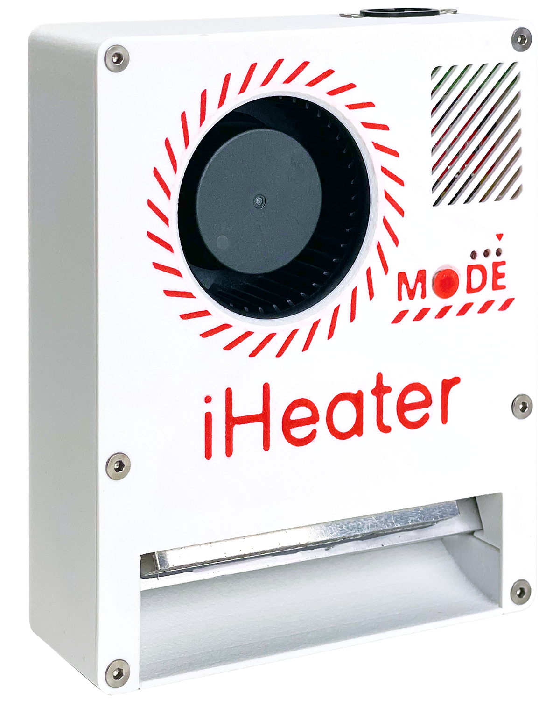

<!-- [](https://github.com/pavluchenkor/iHeater-Standalone-Firmware/releases) -->
<!-- [](https://docs.idryer.org/iHeater/) -->
<!-- [](https://t.me/iDryer) -->
<!-- [](https://discord.gg/jGce5eeHHz) -->


# Standalone iHeater Firmware

iHeater - это компактное и доступное решение для 3D-принтеров без активной термокамеры или с ограниченными возможностями подключения к материнской плате. Он особенно полезен для моделей с проприетарными платами, где нет свободных разъёмов для вентилятора, нагревателя или термистора. iHeater решает эту задачу простым и универсальным способом.


Может работать самостоятельно с собственной прошивкой как отдельное устройство или под управлением Klipper с подключением к принтеру по USB



---

## О прошивке

**iHeater** - это прошивка для автономного устройства управления температурой камеры 3D-принтера. 

---

## Назначение

Устройство обеспечивает нагрев и поддержание стабильной температуры внутри камеры 3D-принтера, что критично для печати ABS, ASA и других температурозависимых пластиков с высокой усадкой и низкой адгезией слоев.

---

## Как настроить прошивку

### Файл `config.h`

В этом файле задаются параметры работы устройства:
Файл находится в папке Core/Inc/config.h

| Параметр                                    | Назначение                                                                                          |
| ------------------------------------------- | --------------------------------------------------------------------------------------------------- |
| `SELECTED_THERMISTOR_TYPE`                  | Выбор типа термистора (0-5, см. ниже)                                                               |
| `MODE_TEMP_0`-`MODE_TEMP_7`                             | Температуры для каждого режима. Можно задать любое значение, включая дробные, например `MODE_TEMP_4 67.5` |
| `MAX_TEMP`, `MIN_TEMP`                      | Допустимый диапазон температур нагревателя                                                          |
| `MAX_AIR_TEMP`, `MIN_AIR_TEMP`              | Диапазон температур воздуха                                                                         |
| `HEATER_MIN_PWM`                            | Минимальный PWM, при котором система начнёт проверку ответа нагревателя                             |
| `HEATER_RESPONSE_TIMEOUT_MS`                | Время ожидания роста температуры нагревателя (по умолчанию 5 сек)                                   |
| `AIR_TARGET_TIMEOUT_MS`                     | Максимальное время достижения целевой температуры воздуха (по умолчанию 10 мин)                     |
| `TIMER_CLOCK`, `PWM_FREQUENCY`, `PWM_STEPS` | Настройка частоты и качества ШИМ                                                                    |

### Термисторы

Выбираются в `SELECTED_THERMISTOR_TYPE`. Поддерживаются:

| ID | Тип                          | Комментарий                           |
| -- | ---------------------------- | ------------------------------------- |
| 0  | ATC Semitec 104GT-2          | Стандарт от E3D                       |
| 1  | ATC Semitec 104NT-4-R025H42G | Аналог 104GT                          |
| 2  | EPCOS 100K B57560G104F       | Популярен                             |
| 3  | Generic 3950                 | **По умолчанию**, широко используемый |
| 4  | SliceEngineering 450         | Поддержка высоких температур          |
| 5  | TDK NTCG104LH104JT1          | Медицинский, точный                   |

### Режимы температуры и светодиоды

Режим задаётся значением температуры и отображается в двоичном виде тремя светодиодами:

При выходе на режим светодиоды мигают, по выходу на режим - светят постоянно

| Mode   | Temperature | LED3 | LED2 | LED1 |
|--------|-------------|------|------|------|
| MODE_TEMP_0  | 0.0°C       |   |   |   |
| MODE_TEMP_1  | 55.0°C      |   |   |   |
| MODE_TEMP_2  | 60.0°C      |   |   |   |
| MODE_TEMP_3  | 65.0°C      |   |   |   |
| MODE_TEMP_4  | 70.0°C      |   |   |   |
| MODE_TEMP_5  | 75.0°C      |   |   |   |
| MODE_TEMP_6  | 80.0°C      |   |   |   |
| MODE_TEMP_7  | 85.0°C      |   |   |   |

---
### Автоматическое включение и выключение r1.1

Макросы
```
#define TRIGGER_ON_TEMP  45.0f
#define TRIGGER_OFF_TEMP 80.0f
#define TRIGGER_MODE MODE_2
```

Отвечают за температуру включения и выключения нагревателя а так же за режим при включении. 

Предположим что термистор триггера расположен в районе нагревателя стола.
С текущими настройками нагрев камеры включится когда температура стола будет 45 и выключится когда температура стола опустится ниже 80, такие параметры приемлемы для большинства пластиков требующих активной термокамеры и не вызывают логических конфликтов при работе.

Так же можно выбрать режим который будет запущен при срабатывании триггера. Например сейчас выбран TRIGGER_MODE MODE_2 и это значит что будет запущен режим MODE_TEMP_2 -  температура в камере 60.0°C

---
### Работа с iHeater-link (сборка r1.1 pulse)

Сборка `iheater_rev1_1_pulse` рассчитана на совместную работу с модулем iHeater-link на ESP. Модуль получает команды от принтера, портала или мобильного приложения и транслирует уставку камеры в iHeater по одной GPIO-линии. Прошивка iHeater не зависит от стороны принтера и не знает про транспорт — она принимает только число: желаемую температуру воздуха в камере в °C.

#### Подключение

1. Прошейте iHeater сборкой `iheater_rev1_1_pulse` (см. раздел «Как прошить»).
2. Сигнальный провод от iHeater-link подключите к разъёму **TH2** платы iHeater (пин PB1).
3. Общий GND между ESP и iHeater обязателен — используйте отдельный провод земли.
4. Термистор нагревателя оставьте на своём штатном разъёме **TH0**. Термистор воздуха — на **TH1**. Они работают как в любой другой сборке.
5. Разъём триггера в этой сборке не используется (его линия занята цифровым входом).

!!! warning "Никогда не подключайте и не отключайте сигнальный провод при поданном питании."

#### Принимаемые команды

| Код от iHeater-link | Смысл |
|---------------------|--------|
| `0`                 | Выключить нагрев |
| `10`                | Выключить нагрев (согласованный «off-code») |
| `45..90`            | Включить нагрев, уставка воздуха в °C равна коду |
| остальные значения  | Игнорируются, сохраняется предыдущее состояние |

Минимум `45 °C` задан в `config.h` макросом `PULSE_MIN_TARGET`. Максимум ограничен `MAX_AIR_TEMP` (по умолчанию 90 °C).

#### Индикация LED

| Состояние | LED1 | LED2 | LED3 |
|-----------|------|------|------|
| Ожидание первого пакета после включения (до 20 с) | бегущий огонёк LED1 → LED2 → LED3 с шагом 1000 мс | | |
| Связь ОК, нагрев выключен | горит постоянно (heartbeat «связь жива») | погашен | короткая вспышка ~80 мс на каждый принятый пакет |
| Связь ОК, нагрев включён | бегущий огонёк LED1 → LED2 → LED3 с шагом 500 мс | | |
| Потеряна связь (более 1.5 с без пакета после первого подключения) | Все три мигают синхронно; устройство перезагружается с кодом ошибки `0x08` (`ERROR_LINK_LOST`). Нагреватель выключен. | | |

Штатные ошибки (перегрев, обрыв термистора, нагреватель не отвечает) работают так же, как в аналоговых сборках — см. раздел «Как быть в случае ошибки».

#### Поведение при потере связи

После включения питания iHeater и iHeater-link могут стартовать одновременно. Модулю iHeater-link нужно время на инициализацию Wi-Fi и подключение к источнику команд, поэтому в первые **20 секунд** после старта прошивка iHeater **не считает отсутствие пакетов ошибкой** и показывает медленный бегущий огонёк (шаг 1000 мс) — «жду первого пакета».

Если за эти 20 секунд так и не пришёл ни один корректный пакет — прошивка уходит в `ERROR_LINK_LOST` так же, как и при пропадании связи в штатном режиме.

После того как первый пакет принят, действует обычное правило: пропадание пакетов более чем на 1.5 секунды → ошибка.

Алгоритм при срабатывании ошибки:

1. Прошивка сохраняет в flash код ошибки `0x08` (`ERROR_LINK_LOST`).
2. Перезагружает контроллер.
3. После перезагрузки нагреватель выключен; в течение нового 20-секундного окна снова бегущий огонёк ожидания, дальше — медленное мигание всех LED.
4. Для сброса ошибки удерживайте кнопку MODE при подаче питания, затем отпустите. Устройство вернётся к штатной работе.

#### Кнопка MODE

В pulse-сборке кнопка MODE **не переключает режимы и не запускает калибровку**. Её единственная функция — сброс сохранённой ошибки при старте устройства. Все команды нагрева поступают только от iHeater-link.

---

## Как прошить

### Скачать

[Скачайте прошивку со страницы релизов](https://github.com/pavluchenkor/iHeater-Standalone-Firmware/releases)


### Использование готовой прошивки

Прошивка уже сконфигурирована с температурными режимами от MODE_TEMP_0 до MODE_TEMP_7, описанными выше, и предназначена для работы с термистором типа Generic 3950 (тип 3 по списку в `config.h`).

### Использование DFU режима (USB)
=== "r1"

    1. Установите джампер BOOT0
    2. Подключите USB, устройство определится как DFU
    3.1 Загрузите прошивку при помощи STM32CubeProgrammer:

    3.1.1 Укажите путь к `.bin`-файлу прошивки (например: `Firmware/iHeater_v1.2.3.bin`)
    3.1.2 Установите адрес загрузки: `0x08000000`

    3.1.3 Нажмите "Start Programming"

    или

    3.2 Загрузите прошивку через командную строку:
        ```bash
        dfu-util -a 0 -s 0x08000000 -D Firmware/iHeater_vX.Y.Z.bin
    4. Уберите джампер и перезапустите питание

=== "r1.1"

    1. Зажмите кнопку BOOT
    2. Подключите USB, устройство определится как DFU
    3. Загрузите прошивку при помощи STM32CubeProgrammer:

        3.1.1 Укажите путь к `.bin`-файлу прошивки (например: `Firmware/iHeater_v1.2.3.bin`)

        3.1.2 Установите адрес загрузки: `0x08000000`

        3.1.3 Нажмите "Start Programming"

        или

        3.2 Загрузите прошивку через командную строку:
            ```bash
            dfu-util -a 0 -s 0x08000000 -D Firmware/iHeater_vX.Y.Z.bin
            ```
    4. Перезапустите питание

---

## Как пользоваться
=== "r1"

    - **Короткое нажатие** кнопки MODE - переключение режимов (0-7)
    - **Долгое удержание (2+ сек)** - сброс режима до 0 (OFF)
    - **Светодиоды** отображают текущий режим по таблице выше
    - **Мерцание светодиодов** - режим активен, но ещё не достигнута температура
    - **Постоянный свет** - целевая температура достигнута

=== "r1.1"

    !!! note "Отличия ревизий"
   
        ревизия r1.1 имеет триггерный порт для автоматического включения и выключения нагрева камеры. При подключении термистора к триггерному порту нагрев будет включаться и выключаться в соответствии с температурами указанными в config.h, по умолчанию это 45 и 80 для включения и выключения нагрева.

    - **Короткое нажатие** кнопки MODE - переключение режимов (0-7)
    - **Долгое удержание (2+ сек)** - сброс режима до 0 (OFF)
    - **Светодиоды** отображают текущий режим по таблице выше
    - **Мерцание светодиодов** - режим активен, но ещё не достигнута температура
    - **Постоянный свет** - целевая температура достигнута

---

## Как быть в случае ошибки

Устройство автоматически перезапускается и показывает код ошибки светодиодами, кулер при этом будет включен.


| Code  | Description                               | LED3 | LED2 | LED1  |
|-------|-------------------------------------------|------|------|-------|
| 0x01  | Air failed to reach target in time        |  | |  |
| 0x02  | Heater not responding                     | |  |  |
| 0x03  | Manual shutdown (unused)                  |  |  |  |
| 0x04  | Air thermistor disconnected                | | |   |
| 0x05  | Heater thermistor disconnected             |  | |   |
| 0x06  | Heater overtemperature                     | |  |   |
| 0x07  | Air overtemperature                        |  |  |   |
| 0x08  | Потеряна связь с iHeater-link (только pulse-сборка) | 0.25 Гц | 0.25 Гц | 0.25 Гц |
| 0xFF  | Unknown error                              |  | |  |


### Сброс ошибки

Удерживайте кнопку MODE при старте до тех пор, пока светодиоды не поменяют индикацию. Ошибка будет стерта из flash и устройство продолжит обычную работу.

## Тонкая настройка

В случае когда есть подтверждение, что показания термистора отличаются от фактической температуры, можно воспользоваться функцией тонкой настройки, для этого необходимо измерить сопротивления соответствующих резисторов и записать их вместо дефолтных значений


```C++ title="Actual resistance of the pull-up resistors"
#define PULLUP_TH0 4700.0f
#define PULLUP_TH1 4700.0f
#define PULLUP_TH2 4700.0f
```


---

Это программное обеспечение лицензировано в соответствии с GNU General Public License v3.0 только для некоммерческого использования.