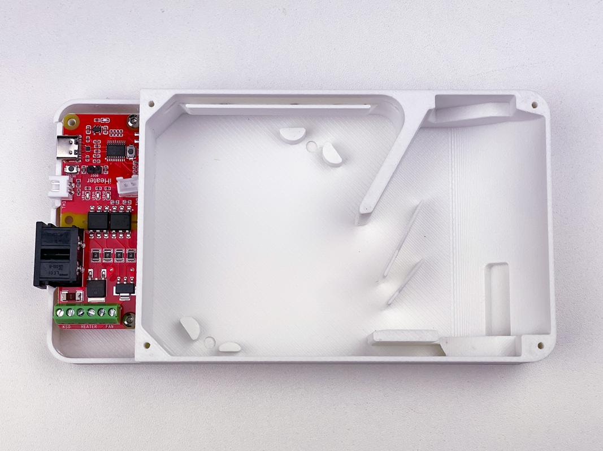
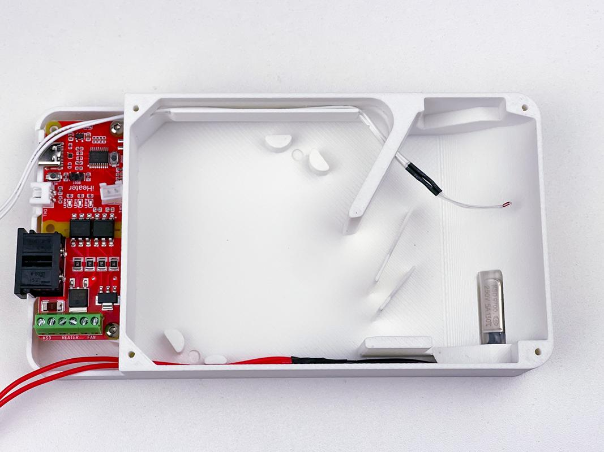
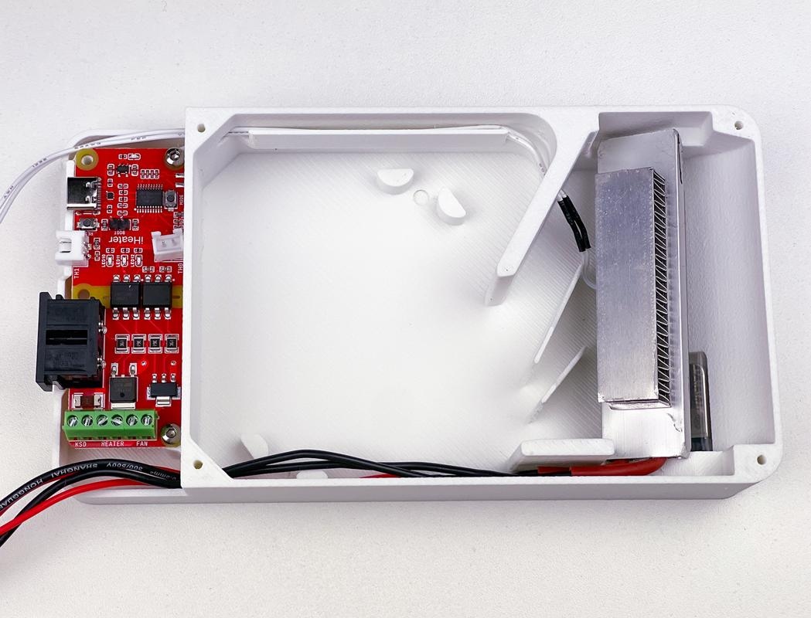
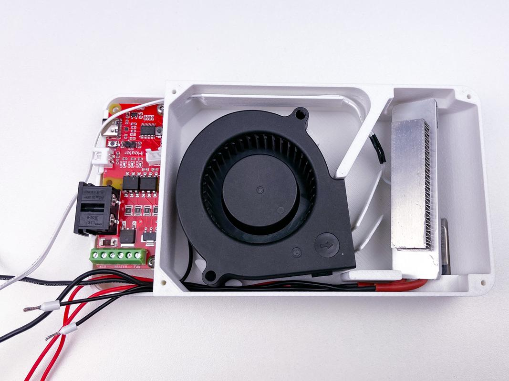
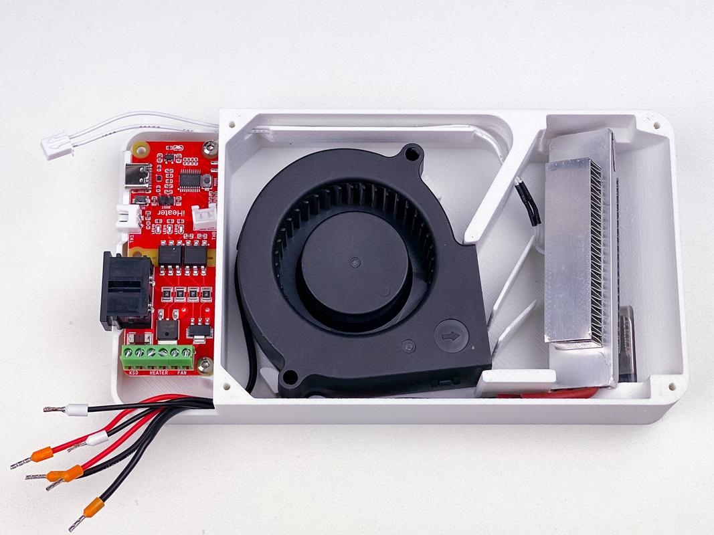
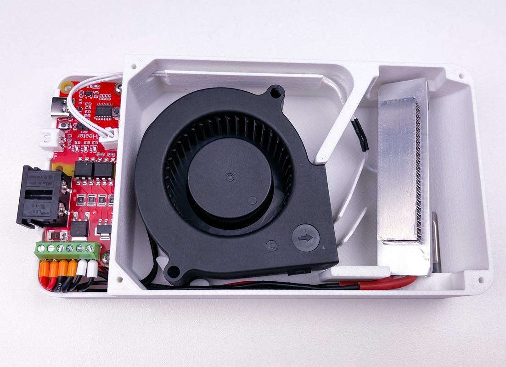
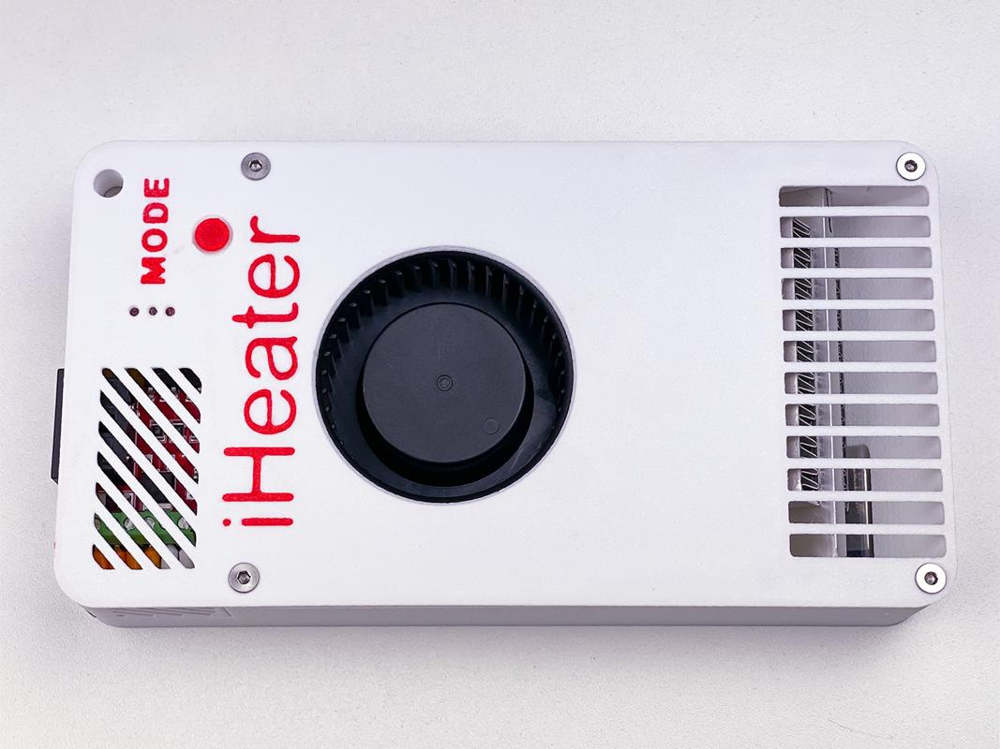
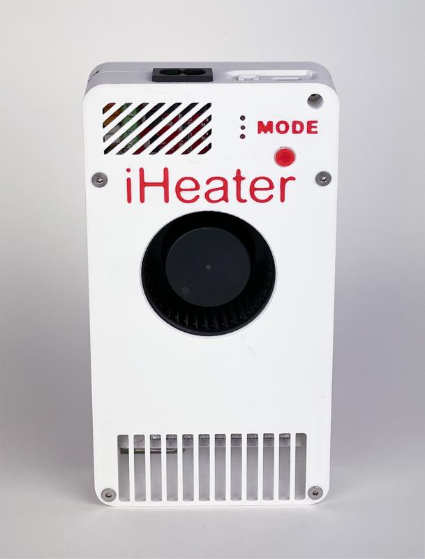

# Assembly

## 1. Installing the Board

## 2. Installing the Thermistor and KSD

## 3. Installing the Heater

## 4. Wiring

## 5. Installing Ferrules

## 5. Wiring Connections

## 6. Final Assembly

## 7. Finished Product

