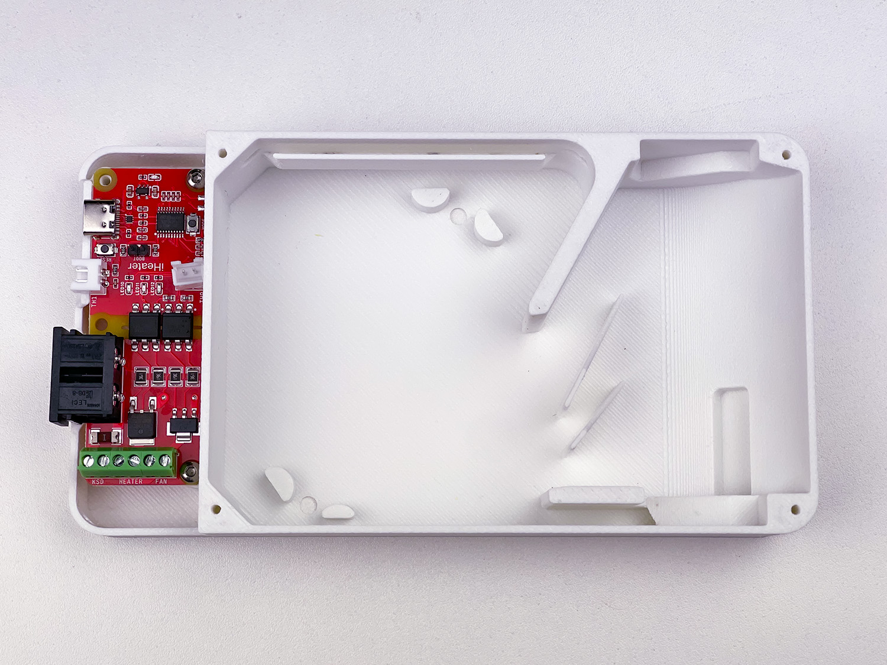
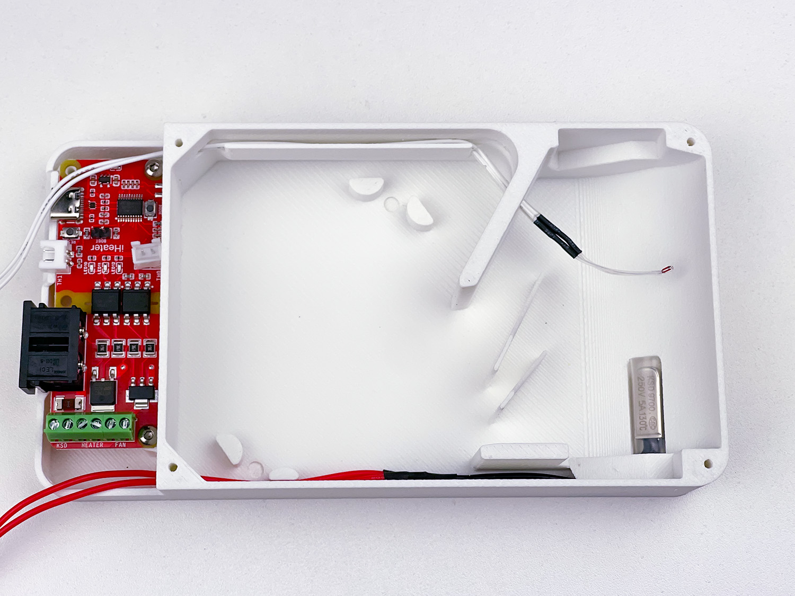
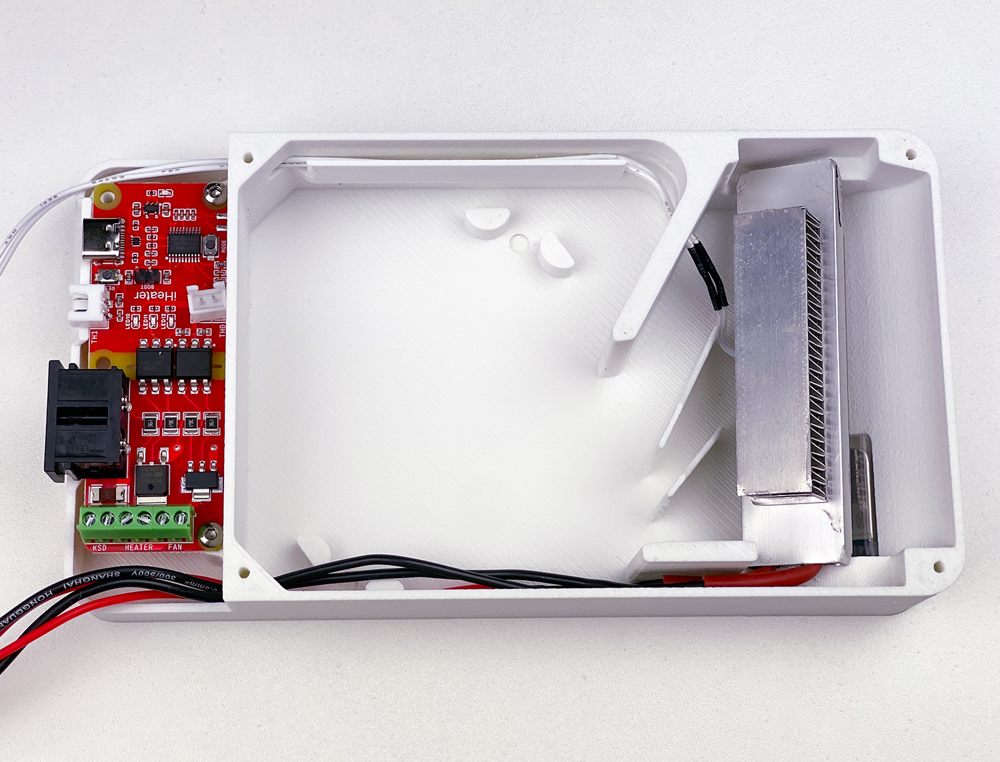
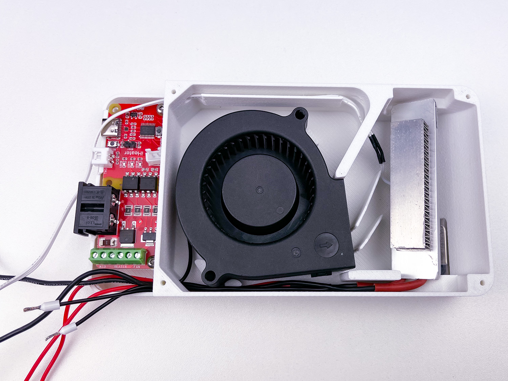
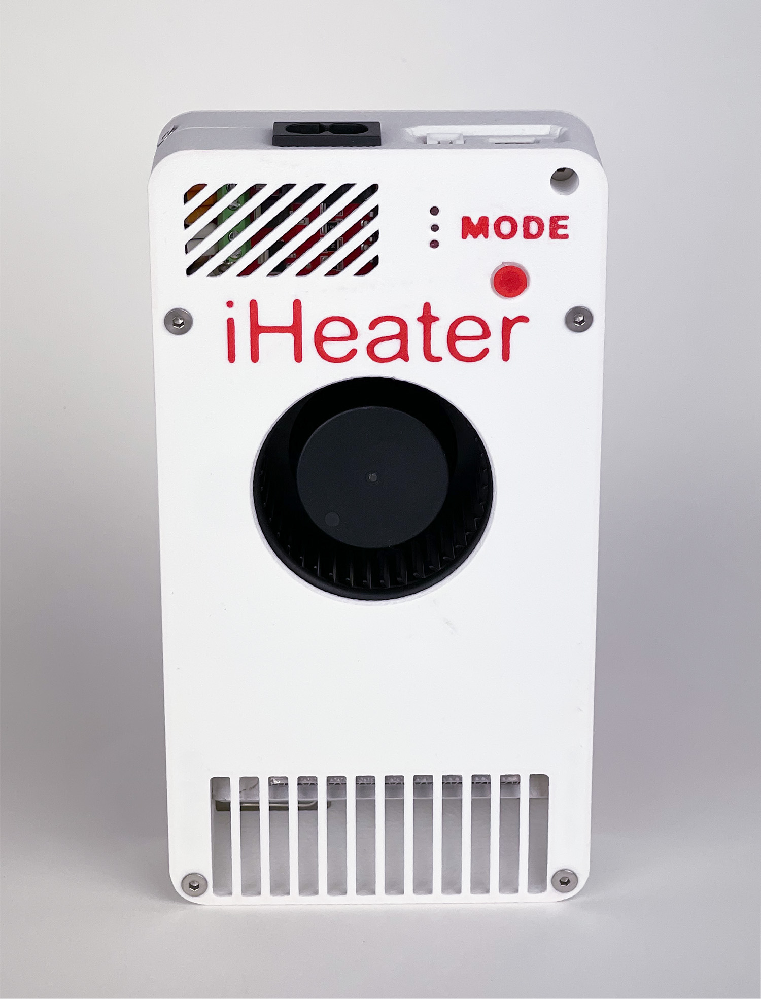

# Montagem

## 1 Instalação da Placa

## 2 Instalação do Termistor e KSD

## 3 Instalação do Aquecedor

## 4 Fiação

## 5 Instalação do NSKVI

## 5 Comutação

## 6 Montagem Final

## 7 Produto Acabado

